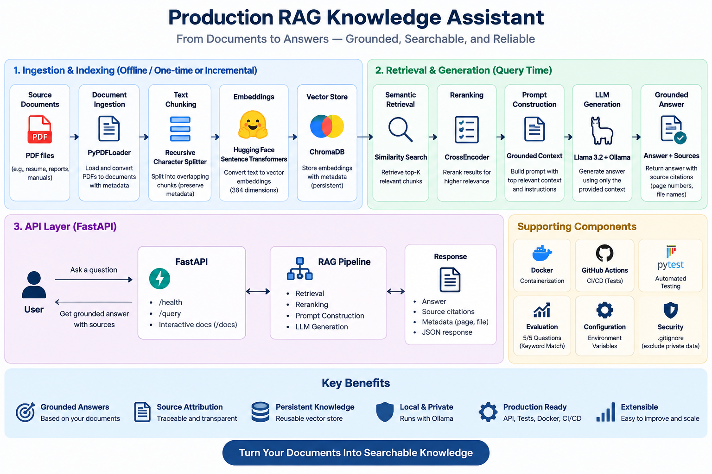

\# 🚀 Production RAG Knowledge Assistant


<p align="center">

&#x20; <b>Production-style Retrieval-Augmented Generation system for grounded document question answering</b>

</p>


<p align="center">

&#x20; 

&#x20; 

&#x20; 

&#x20; 

&#x20; 

&#x20; 

&#x20; 

&#x20; 

</p>


\---


\## 📌 Overview


\*\*Production RAG Knowledge Assistant\*\* is an end-to-end Retrieval-Augmented Generation application designed to answer questions from private document collections using grounded context rather than relying only on an LLM's pretrained knowledge.


The system takes source documents, converts them into searchable chunks, generates semantic embeddings, stores them in a persistent vector database, retrieves relevant information, reranks the retrieved results, and passes the highest-quality context to a local Llama 3.2 model for answer generation.


The generated response includes \*\*source references\*\* so users can understand where the answer came from.


\### 🎯 Main Goal


Build a practical RAG architecture that demonstrates how modern AI applications can combine:


\*\*Document Processing → Embeddings → Vector Search → Reranking → LLM Generation → Source Attribution\*\*


\---


\# 🧠 What This Project Demonstrates


This project demonstrates practical experience with:


\- Retrieval-Augmented Generation (RAG)

\- Large Language Models (LLMs)

\- Semantic search

\- Vector databases

\- Sentence embeddings

\- CrossEncoder reranking

\- Prompt engineering

\- Grounded generation

\- Document ingestion

\- Text chunking

\- REST API development

\- Automated testing

\- Evaluation workflows

\- Docker containerization

\- CI/CD with GitHub Actions

\- Local AI inference


\---


\# 🏗️ System Architecture


<p align="center">

&#x20; 

</p>


```text

&#x20;                        ┌──────────────────────┐

&#x20;                        │    Source Documents  │

&#x20;                        │       PDF Files      │

&#x20;                        └──────────┬───────────┘

&#x20;                                   │

&#x20;                                   ▼

&#x20;                        ┌──────────────────────┐

&#x20;                        │  Document Ingestion  │

&#x20;                        │      PyPDFLoader     │

&#x20;                        └──────────┬───────────┘

&#x20;                                   │

&#x20;                                   ▼

&#x20;                        ┌──────────────────────┐

&#x20;                        │    Text Chunking     │

&#x20;                        │ Recursive Splitter   │

&#x20;                        └──────────┬───────────┘

&#x20;                                   │

&#x20;                                   ▼

&#x20;                        ┌──────────────────────┐

&#x20;                        │     Embeddings       │

&#x20;                        │ HuggingFace MiniLM   │

&#x20;                        │      384 dimensions  │

&#x20;                        └──────────┬───────────┘

&#x20;                                   │

&#x20;                                   ▼

&#x20;                        ┌──────────────────────┐

&#x20;                        │      ChromaDB        │

&#x20;                        │ Persistent Vector DB │

&#x20;                        └──────────┬───────────┘

&#x20;                                   │

&#x20;                        User Question

&#x20;                                   │

&#x20;                                   ▼

&#x20;                        ┌──────────────────────┐

&#x20;                        │ Semantic Retrieval   │

&#x20;                        │    Top-K Results     │

&#x20;                        └──────────┬───────────┘

&#x20;                                   │

&#x20;                                   ▼

&#x20;                        ┌──────────────────────┐

&#x20;                        │     Reranking        │

&#x20;                        │     CrossEncoder     │

&#x20;                        └──────────┬───────────┘

&#x20;                                   │

&#x20;                                   ▼

&#x20;                        ┌──────────────────────┐

&#x20;                        │   Prompt Builder     │

&#x20;                        │ Grounded Context     │

&#x20;                        └──────────┬───────────┘

&#x20;                                   │

&#x20;                                   ▼

&#x20;                        ┌──────────────────────┐

&#x20;                        │     Llama 3.2        │

&#x20;                        │       Ollama         │

&#x20;                        └──────────┬───────────┘

&#x20;                                   │

&#x20;                                   ▼

&#x20;                        ┌──────────────────────┐

&#x20;                        │ Grounded Answer +    │

&#x20;                        │ Source Citations     │

&#x20;                        └──────────────────────┘

```


\---


\# 🔄 End-to-End RAG Pipeline


The application follows a multi-stage retrieval and generation pipeline.


\## 1. Document Ingestion


PDF documents are loaded and converted into structured document objects.


Each document retains metadata such as:


\- Source filename

\- Page number

\- Document content


This metadata is later used for source attribution.


\---


\## 2. Text Chunking


Large documents are divided into smaller overlapping chunks.


Chunking allows the retrieval system to search smaller, semantically meaningful sections instead of processing an entire document at once.


The chunking stage also preserves document metadata so retrieved results can be traced back to their source.


\---


\## 3. Embedding Generation


Each chunk is converted into a numerical vector representation using a Hugging Face sentence-transformer model.


The project currently produces:


```text

Embedding dimensions: 384

```


These embeddings allow the system to compare the semantic similarity between:


```text

User Question

&#x20;     ↓

Document Chunks

```


rather than relying only on exact keyword matching.


\---


\## 4. Vector Storage


The generated embeddings are stored in \*\*ChromaDB\*\*.


The vector store is persistent, which means the application can reload an existing knowledge base without rebuilding the embeddings every time the application starts.


This separates:


```text

Ingestion / Indexing

```


from:


```text

Query / Retrieval

```


\---


\## 5. Semantic Retrieval


When a user asks a question, the question is converted into the same embedding space as the documents.


The vector database then retrieves the most semantically relevant chunks.


Example:


```text

Question:

"What experience does Sahana have with RAG?"


&#x20;       ↓


Semantic Search


&#x20;       ↓


Relevant document chunks

```


\---


\## 6. CrossEncoder Reranking


Initial vector retrieval provides candidate documents.


The project then applies a \*\*CrossEncoder reranker\*\* to reorder those candidates according to their relevance to the actual question.


This creates a two-stage retrieval architecture:


```text

Stage 1:

Vector Similarity Search

&#x20;       ↓

Candidate Documents


Stage 2:

CrossEncoder Reranking

&#x20;       ↓

Highest-Relevance Context

```


This helps separate broad semantic retrieval from more precise relevance scoring.


\---


\# 🤖 LLM Generation


The project uses:


\*\*Llama 3.2 + Ollama\*\*


for local answer generation.


The model receives:


```text

System Instructions

&#x20;       +

Retrieved Context

&#x20;       +

User Question

```


The prompt explicitly instructs the model to answer using only the supplied context.


If the information is not available, the model is instructed to respond:


```text

I don't know based on the provided documents.

```


This design helps reduce unsupported answers and keeps the response grounded in the indexed documents.


\---


\# 📚 Source Citations


The generation stage labels retrieved context:


```text

\[Source 1]

\[Source 2]

\[Source 3]

```


The generated response can then reference the relevant source.


Example:


```text

Sahana has experience building Retrieval-Augmented

Generation workflows for contextual search and

question-answering \[Source 3].

```


The API also returns source metadata:


```json

{

&#x20; "source": 3,

&#x20; "page": 2,

&#x20; "file": "sahana\_resume.pdf"

}

```


Page numbers returned by the API are converted to human-friendly numbering.


\---


\# ⚙️ Technology Stack


| Category | Technology |

|---|---|

| Language | Python 3.13 |

| RAG Framework | LangChain |

| LLM | Llama 3.2 |

| Local LLM Runtime | Ollama |

| Embeddings | Hugging Face Sentence Transformers |

| Embedding Size | 384 dimensions |

| Vector Database | ChromaDB |

| Reranker | CrossEncoder |

| PDF Processing | PyPDFLoader |

| API Framework | FastAPI |

| API Server | Uvicorn |

| Testing | Pytest |

| Containerization | Docker |

| CI/CD | GitHub Actions |

| Configuration | Environment variables |


\---


\# 📁 Project Structure


```text

production-rag-knowledge-assistant/

│

├── api/

│   └── main.py

│

├── evaluation/

│   ├── eval\_dataset.json

│   └── evaluate.py

│

├── src/

│   └── rag\_assistant/

│       ├── \_\_init\_\_.py

│       ├── chunking.py

│       ├── config.py

│       ├── embeddings.py

│       ├── generation.py

│       ├── ingestion.py

│       ├── pipeline.py

│       ├── reranker.py

│       ├── retrieval.py

│       └── vector\_store.py

│

├── tests/

│   ├── test\_api.py

│   ├── test\_chunking.py

│   └── test\_retrieval.py

│

├── .github/

│   └── workflows/

│       └── tests.yml

│

├── .dockerignore

├── .env.example

├── .gitignore

├── Dockerfile

├── pyproject.toml

├── requirements.txt

└── README.md

```


\---


\# 🧩 Core Components


\## `ingestion.py`


Responsible for loading source PDF documents.


```text

PDF → Document Objects

```


\---


\## `chunking.py`


Responsible for splitting documents into smaller searchable chunks.


```text

Documents → Chunks

```


\---


\## `embeddings.py`


Loads the Hugging Face embedding model and converts text into vector representations.


```text

Text → 384-dimensional vector

```


\---


\## `vector\_store.py`


Responsible for creating and loading the persistent ChromaDB vector store.


Supports:


```text

Create Vector Store

Load Existing Vector Store

```


\---


\## `retrieval.py`


Performs semantic similarity retrieval against ChromaDB.


```text

Question → Relevant Documents

```


\---


\## `reranker.py`


Uses a CrossEncoder model to reorder retrieved documents based on relevance.


```text

Retrieved Documents

&#x20;       ↓

CrossEncoder

&#x20;       ↓

Reranked Documents

```


\---


\## `generation.py`


Responsible for:


\- Building the grounded prompt

\- Formatting source context

\- Calling Llama 3.2

\- Returning the generated answer


\---


\## `pipeline.py`


Orchestrates the complete RAG workflow.


```text

Query

&#x20;↓

Retrieval

&#x20;↓

Reranking

&#x20;↓

Prompt Construction

&#x20;↓

LLM Generation

&#x20;↓

Answer + Sources

```


\---


\## `api/main.py`


Exposes the RAG system through FastAPI.


Available endpoints:


```text

GET  /health

POST /query

```


\---


\# 🌐 API Usage


\## Start the API


```bash

uvicorn api.main:app --reload

```


The API will be available at:


```text

http://localhost:8000

```


Interactive Swagger documentation:


```text

http://localhost:8000/docs

```


\---


\## Health Check


\### Request


```http

GET /health

```


\### Response


```json

{

&#x20; "status": "healthy"

}

```


\---


\## Query Endpoint


\### Request


```http

POST /query

```


Body:


```json

{

&#x20; "question": "What experience does Sahana have with RAG?"

}

```


\### Example Response


```json

{

&#x20; "question": "What experience does Sahana have with RAG?",

&#x20; "answer": "Sahana has experience with Retrieval-Augmented Generation (RAG) workflows, as mentioned in \[Source 3]. Specifically, she built and maintained LLM and RAG workflows to provide contextual search and question-answering capabilities over approved enterprise information.",

&#x20; "sources": \[

&#x20;   {

&#x20;     "source": 1,

&#x20;     "page": 1,

&#x20;     "file": "data\\\\sample\\\\sahana\_resume.pdf"

&#x20;   },

&#x20;   {

&#x20;     "source": 2,

&#x20;     "page": 1,

&#x20;     "file": "data\\\\sample\\\\sahana\_resume.pdf"

&#x20;   },

&#x20;   {

&#x20;     "source": 3,

&#x20;     "page": 2,

&#x20;     "file": "data\\\\sample\\\\sahana\_resume.pdf"

&#x20;   }

&#x20; ]

}

```


\---


\# 🧪 Testing


The project includes automated tests for core functionality.


Run:


```bash

pytest -v

```


Current test suite:


```text

tests/test\_api.py

tests/test\_chunking.py

tests/test\_retrieval.py

```


Current result:


```text

3 passed

```


The test suite verifies:


\- API health endpoint

\- Document chunking

\- Retrieval behavior


\---


\# 📊 RAG Evaluation


The project includes a separate evaluation workflow.


Run:


```bash

python -m evaluation.evaluate

```


The current evaluation dataset contains \*\*5 questions\*\* covering:


\- RAG experience

\- Programming languages

\- Cloud platforms

\- Python frameworks

\- Data-processing technologies


\### Current measured result


```text

Questions evaluated: 5

Questions passed: 5

Keyword Match Rate: 100.00%

```


\### Important Evaluation Note


The `100.00%` value represents the \*\*keyword match rate for the current five-question evaluation dataset\*\*.


It is not presented as a general-purpose RAG accuracy score.


Future evaluation will include retrieval-specific metrics and larger datasets.


\---


\# 🐳 Docker


The application can be packaged as a Docker container.


\## Build


```bash

docker build -t production-rag-assistant .

```


\## Run


```bash

docker run --rm -p 8000:8000 production-rag-assistant

```


The API is then available at:


```text

http://localhost:8000

```


Swagger:


```text

http://localhost:8000/docs

```


\### Docker Optimization


A `.dockerignore` file prevents unnecessary local files from entering the Docker build context.


Excluded items include:


```text

.venv/

.git/

chroma\_db/

.pytest\_cache/

.env

```


This reduced the Docker build context from approximately:


```text

1.36 GB

```


to approximately:


```text

2.56 KB

```


during local testing.


\---


\# 🔄 CI/CD


GitHub Actions is configured to run automatically on:


```text

Push

Pull Request

```


Workflow:


```text

GitHub Push

&#x20;    ↓

Checkout Repository

&#x20;    ↓

Setup Python 3.13

&#x20;    ↓

Install Dependencies

&#x20;    ↓

Run Pytest

&#x20;    ↓

Pass / Fail

```


Current CI status:


```text

✅ GitHub Actions workflow passing

```


\---


\# 🔐 Configuration \& Security


Environment-specific configuration is kept outside the source code.


Example configuration:


```text

LLM\_PROVIDER=ollama

LLM\_MODEL=llama3.2

```


Sensitive environment files are excluded through `.gitignore`.


The repository also excludes:


```text

.env

.venv/

chroma\_db/

private sample PDFs

```


This prevents local credentials, generated vector data, and private documents from being accidentally committed.


\---


\# 🛠️ Local Installation


\## 1. Clone the repository


```bash

git clone https://github.com/Srisahana1/production-rag-knowledge-assistant.git

cd production-rag-knowledge-assistant

```


\## 2. Create a virtual environment


```bash

python -m venv .venv

```


\## 3. Activate it


\### Windows


```powershell

.\\.venv\\Scripts\\Activate.ps1

```


\### Linux / macOS


```bash

source .venv/bin/activate

```


\## 4. Install dependencies


```bash

pip install -r requirements.txt

```


\## 5. Install Ollama


Install Ollama and download the model:


```bash

ollama pull llama3.2

```


\## 6. Add a source document


Place a PDF inside:


```text

data/sample/

```


\## 7. Build the vector store


Use the project's ingestion pipeline to process the document and create the persistent ChromaDB index.


\## 8. Start the API


```bash

uvicorn api.main:app --reload

```


\---


\# 💡 Example Questions


Once a document is indexed, the assistant can answer questions such as:


```text

What experience does the candidate have with RAG?


What programming languages does the candidate use?


Which cloud platforms has the candidate worked with?


What Python frameworks has the candidate used?


What data-processing technologies does the candidate know?

```


The important characteristic is that the answers are generated from retrieved document context rather than asking the LLM to answer without evidence.


\---


\# 🏆 Engineering Highlights


\### Persistent Knowledge Base


The application can load an existing ChromaDB index rather than recreating the vector store for every query.


\### Two-Stage Retrieval


The system combines:


```text

Vector Retrieval

\+

CrossEncoder Reranking

```


to improve the relevance of the final context.


\### Grounded Generation


The LLM is instructed to use only retrieved context.


\### Source Attribution


Generated answers reference supporting context using:


```text

\[Source N]

```


\### Local AI


Llama 3.2 runs through Ollama, allowing the core generation workflow to run locally without requiring a paid hosted LLM API.


\### API Layer


FastAPI exposes the RAG pipeline as a REST service.


\### Automated Testing


Pytest validates important application components.


\### Continuous Integration


GitHub Actions automatically executes the test suite after repository changes.


\### Containerization


Docker provides a reproducible runtime environment for the API.


\---


\# ⚠️ Current Limitations


This project is intentionally designed as a portfolio-scale production-style RAG system rather than a fully deployed enterprise platform.


Current limitations include:


\- Small evaluation dataset

\- Keyword-based evaluation rather than comprehensive semantic evaluation

\- Local LLM inference through Ollama

\- No authentication layer

\- No production observability stack

\- No distributed vector database

\- No streaming response implementation

\- Limited document-format support

\- Model instances are initialized during application operations rather than managed through a dedicated application lifecycle


\---


\# 🚀 Future Improvements


Planned improvements include:


\### Retrieval Evaluation


Add:


\- Recall@K

\- Precision@K

\- Mean Reciprocal Rank (MRR)

\- Context relevance

\- Context precision


\### Generation Evaluation


Add:


\- Faithfulness

\- Answer relevance

\- Groundedness

\- Hallucination detection


\### Production Infrastructure


Potential additions:


```text

Redis

PostgreSQL

Cloud-hosted vector database

Authentication

Rate limiting

Observability

Distributed inference

```


\### Advanced RAG


Potential future capabilities:


\- Hybrid keyword + semantic search

\- Query rewriting

\- Multi-query retrieval

\- Parent-document retrieval

\- Metadata filtering

\- Conversational memory

\- Streaming responses

\- Document versioning


\---


\# 📈 Development Journey


The project was built incrementally around a production-oriented workflow:


```text

1\. Document ingestion

&#x20;       ↓

2\. Chunking

&#x20;       ↓

3\. Embedding generation

&#x20;       ↓

4\. Persistent vector storage

&#x20;       ↓

5\. Semantic retrieval

&#x20;       ↓

6\. CrossEncoder reranking

&#x20;       ↓

7\. LLM generation

&#x20;       ↓

8\. Source citations

&#x20;       ↓

9\. FastAPI service

&#x20;       ↓

10\. Evaluation

&#x20;       ↓

11\. Automated testing

&#x20;       ↓

12\. Docker

&#x20;       ↓

13\. GitHub Actions

```


Each major stage was validated independently before being integrated into the complete application.


\---


\# 🎓 What I Learned


This project provided hands-on experience with the architecture behind modern RAG applications, including:


\- How documents become searchable knowledge

\- How embeddings represent semantic meaning

\- How vector databases perform similarity retrieval

\- Why reranking can improve retrieved context

\- How prompts can constrain LLM generation

\- How source attribution can improve answer traceability

\- How to expose AI workflows through REST APIs

\- How to evaluate AI systems with repeatable datasets

\- How to package AI applications with Docker

\- How to automate testing with GitHub Actions


\---


\# 📌 Project Summary


\*\*Production RAG Knowledge Assistant\*\* demonstrates an end-to-end AI application architecture combining document processing, semantic retrieval, reranking, local LLM inference, API development, evaluation, testing, containerization, and CI/CD.


The project focuses on building a RAG workflow that is:


\*\*Grounded • Searchable • Testable • Reproducible • Containerized • Extensible\*\*


\---


\## 👩‍💻 Author


\*\*Sahana Sri V\*\*


AI/ML Engineer | Python Developer


GitHub: \[@Srisahana1](https://github.com/Srisahana1)


\---


⭐ If you find this project useful, consider giving the repository a star.

